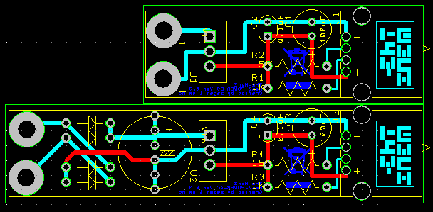
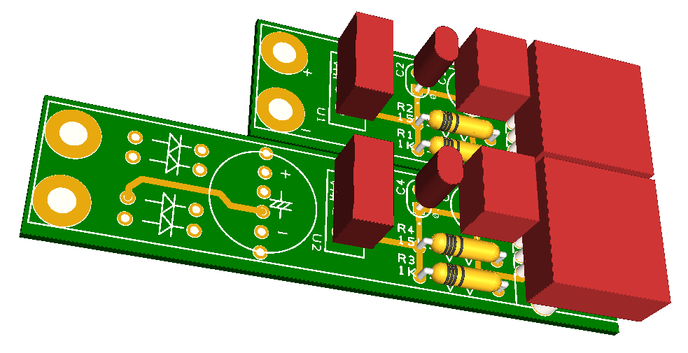
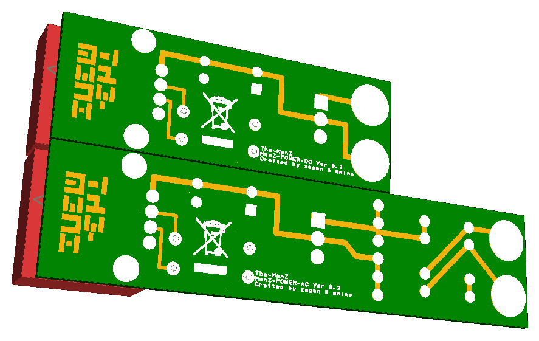

# MenZ-POWER #
***

|幅広い入力電圧|高効率|小型|
|:---:|:---:|:---:|
|各種バッテリーや発電機などDCでもACでも入力可能！|スーパー3端子レギュレータ利用で高効率！|発熱が無いためヒートシンクの省略で小型化！|

### これは何？ ###

24H耐久サバイバルゲーム時に「電動ガンの予備バッテリーからスマホに充電できればなぁ」という発想から生まれました。

### 特徴 ###

7~27Vの入力でUSBから5Vを出力します。
DCタイプとACタイプの二つがあります。
電源入力部分はM3ネジサイズで圧着端子で固定できます。

### どうやって作るの？ ###

###### 1. 必要な部品を確認しましょう

|名前|型番|個数|
|:---|:---|:---:|
|スーパー3端子レギュレータ|R-78E5.0-0.5|1|
|電解コンデンサ|10V 100uF|1|
|コンデンサ|0.1uF|1|
|抵抗|1KΩ|1|
|抵抗|15kΩ|1|
|USBコネクタ|Aタイプ メス|1|
|M3ネジ|-|2|
|M3ナット|-|2|
|圧着端子|-|2|

###### 2.回路図の通りにパーツをハンダ付けします

### どうやって連絡すれば良い？ ###

* https://twitter.com/The_MenZ3
* https://www.facebook.com/TheMenZ3/
